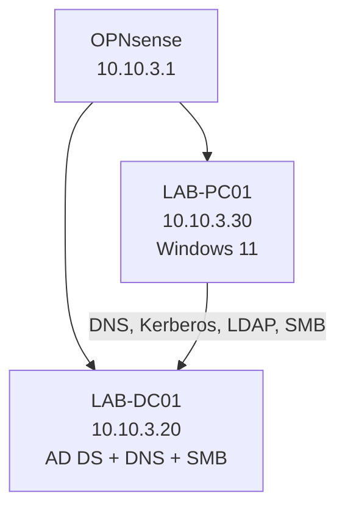

# Windows Active Directory Support Homelab

An isolated Windows support lab built on Proxmox to practice the core work of a junior IT support or small-business/MSP technician: identity administration, DNS, endpoint onboarding, access control, Group Policy, troubleshooting, and backup verification.

This is a personal homelab project, not production experience or a public-facing service.

## What is implemented

| Component | Configuration | Purpose |
|---|---|---|
| Proxmox | `pve-homelab` | Virtualization host for the lab |
| OPNsense | `10.10.3.1/24` on the isolated LAB interface | Gateway and firewall |
| `LAB-DC01` | Windows Server 2025, `10.10.3.20` | Active Directory Domain Services and DNS |
| `LAB-PC01` | Windows 11 Enterprise Evaluation, `10.10.3.30` | Domain-joined employee workstation |
| AD domain | `lab.home.arpa` / NetBIOS `LAB` | Internal identity and DNS namespace |
| SMB share | `\\LAB-DC01\Helpdesk` | Group-based file-access practice |
| Backups | Proxmox snapshot-mode ZSTD backups on `pve-backup` | Recoverable lab baseline |

## Validated capabilities

- Promoted `LAB-DC01` as the first domain controller in `lab.home.arpa`.
- Configured AD-integrated DNS and verified internal and external name resolution.
- Created protected OUs, role-based global security groups, and fictional users.
- Joined `LAB-PC01` to the domain and verified standard-user sign-in.
- Created an SMB share where Helpdesk access succeeds and Accounting access is denied.
- Linked a workstation GPO that displays a login notice on `LAB-PC01`.
- Installed QEMU Guest Agent in both Windows VMs and verified Proxmox guest communication.
- Created successful snapshot-mode ZSTD backups of both Windows VMs on `pve-backup`.

## Repository guide

- [Build and verification record](docs/01-build-and-verification.md)
- [Baseline and client discovery](docs/02-baseline-and-discovery.md)
- [Troubleshooting method](docs/04-troubleshooting-method.md)
- [Practice scenarios](scenarios/README.md)
- [Ticket, change, onboarding, and offboarding templates](templates/)
- [Sanitized evidence guide](evidence/README.md)

## Safety and accuracy rules

- Use only fictional users and business data.
- Keep the lab isolated from home, HMNP, and production systems.
- Never expose Active Directory, SMB, Proxmox, or remote-management services to the public internet.
- Do not commit passwords, keys, tokens, VM backups, ISO images, MAC addresses, public IP addresses, or personal information.
- Document lab work accurately as simulated or homelab experience.

## Next practice phase

The infrastructure build is complete. The next goal is completing support tickets that show repeatable operational work:

1. Onboard a new employee and assign least-privilege access.
2. Reset a password or unlock a simulated account.
3. Process an offboarding request.
4. Diagnose a deliberately incorrect client DNS setting.
5. Document a shared-folder access request and verification.
6. Record a backup review and one safe rollback/restore exercise.
